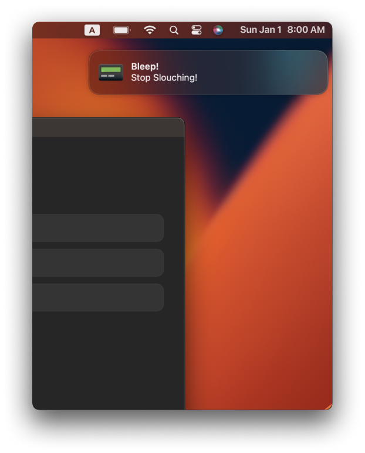

<h1 style="display: flex">
  
  Bleeper
</h1>
 

  <!-- shields -->
  <!-- downloads -->
  
  <!-- version -->
  
  <!-- platform -->
  

 

## About

Bleeper is a desktop app that aims to minimize the brain power you spend on relatively trivial but necessary things such as not slouching or staying hydrated so that you can stay indulged in the more important task requiring deeper focus.

Contrary to the popular saying, our brains are not _really_ computers; and therefore, we are not as good as computers in multitasking. Rather, our brains are designed to focus on one thing at a time. Leave the rest to Bleeper!

## Download

[Download the latest release](https://github.com/Kakamotobi/bleeper/releases) for your OS (MacOS Intel/Apple Silicon, Windows 10/11).

## Installation

### MacOS

1. [Download the .dmg file](https://github.com/Kakamotobi/bleeper/releases) specific to your processor (Intel or Apple Silicon).
2. Open the .dmg file.
3. Drag the Bleeper app file from the .dmg to your Applications directory.
4. Open the Bleeper app.

### Windows

1. [Download the .msi file](https://github.com/Kakamotobi/bleeper/releases).
2. Execute the .msi file.
3. Open the Bleeper app.

## Note
- *Make sure to allow notifications and sound for Bleeper in your OS to receive bleeps.*

## Screenshots

  
  
  
  
  
  

## Features

- Tasks List
  - Maintain a list of tasks.
  - Reset tasks(finished or unfinished) at a specific time.
- Bleeps
  - Activate/deactivate bleeps.
  - Notifications can be sent by the minutes.
  - Set time period to send bleeps.
- Application
  - Light/Dark theme.

## Development

Staying true to Bleeper's objective in loading off overhead, the objective in development was to minimize the burden on your computer as well.

The technologies used were selected based on bundle size, memory usage, processing power needed, battery consumption, and performance.

### Stack

- Frameworks - Tauri, Svelte
- Component/UI Library - none
- Styles - CSS
- Storage - localForage
